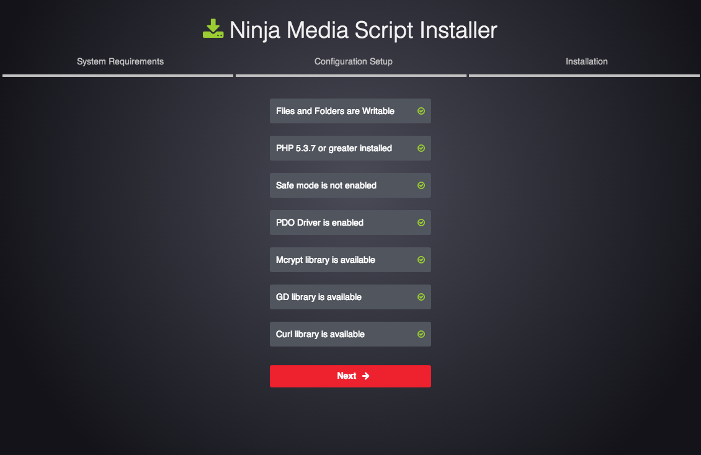
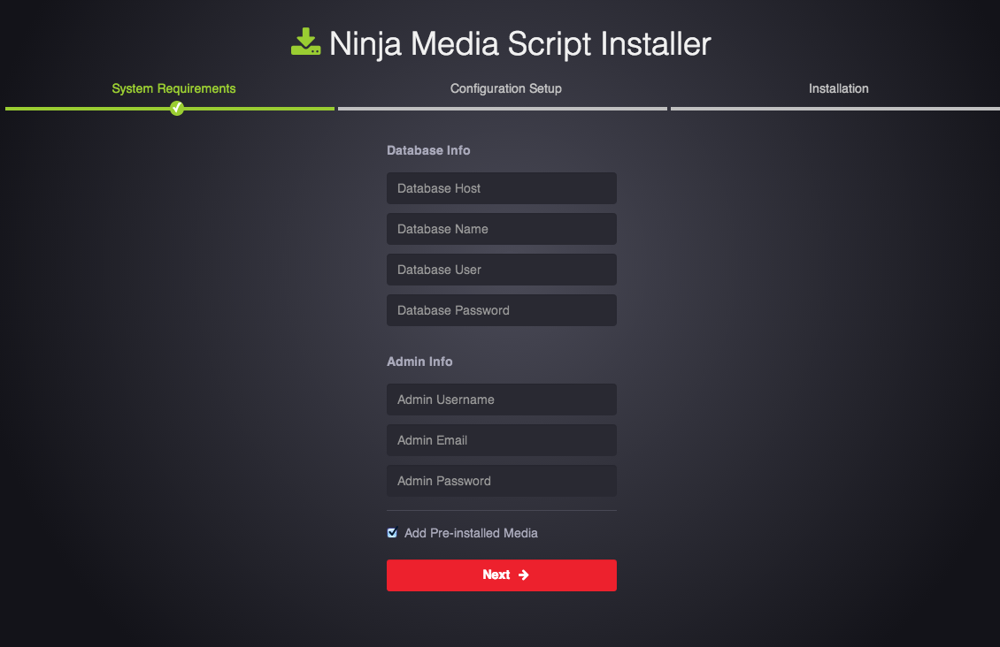
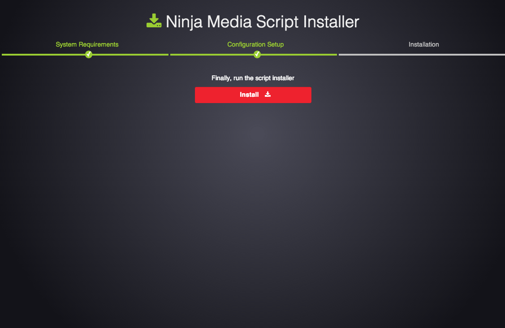
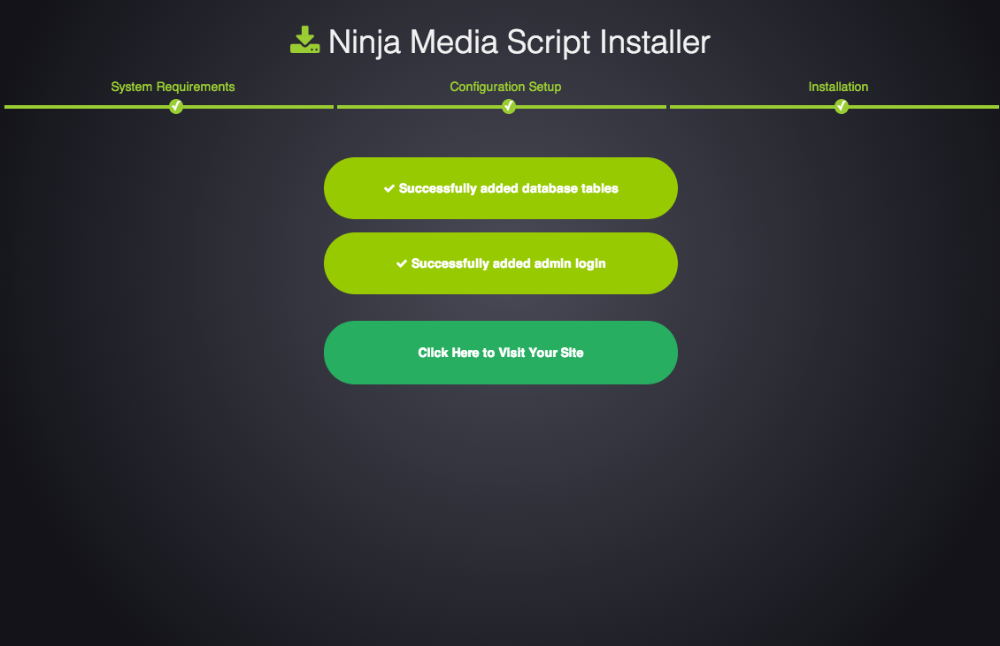

About
===

Ninja Media Script is a Viral Fun Media Sharing Script. This script is so easy to install and customize to make it your own. Users can sign up with Facebook, Google, or Email. This script allows users to upload and like Videos, GIFs, and any other kind of images. Full video support for YouTube, Vimeo, and Vine. Here's what you'll find in this documentation:

 * Installing (2 ways to install)
 * Configuring
 * Troubleshooting
 * Further Reading
 
*Current version: [1.5.1]*

Quick Start Videos
===

Video 01 - Quick Start

<iframe width="640" height="360" src="http://www.youtube.com/embed/hDLAj8p1WXM" frameborder="0" allowfullscreen></iframe>

Video 02 - Media

<iframe width="640" height="360" src="http://www.youtube.com/embed/XUcW-bhFZRY" frameborder="0" allowfullscreen></iframe>

Video 03 - User & Comments

<iframe width="640" height="360" src="http://www.youtube.com/embed/DCQzXtyIjYw" frameborder="0" allowfullscreen></iframe>

Video 04 - Admin

<iframe width="640" height="360" src="http://www.youtube.com/embed/2dmF3q1oNho" frameborder="0" allowfullscreen></iframe>

Video 05 - Infinite Scroll & Responsiveness

<iframe width="640" height="360" src="http://www.youtube.com/embed/3IvjmZztdfQ" frameborder="0" allowfullscreen></iframe>


Install & Upgrade
===

Quick Installation
---

Installing the script is very easy. Follow the steps below to install this script on a local  machine or on your server. If you do not currently have a server. We highly recommend using Media Temples Grid Servers.


1. Move all the files inside of the 'ninja-media-script' folder to the root of your website.
2. Create a new database on your server and give it any name you would like to use.
3. Navigate to 'yourwebsite.com/install.php' and you will be presented with an install screen. The install screen should look similar to the following image:




4 - This screen will tell you if your server meets the minimum requirements for the script. If all goes well you should see a long list of green checkboxes. Finally, click next to visit the Install screen which should look like the following:



5 - Next, on the install screen, you'll enter your database info including your Database Host, Name, User, and Password. Then enter your Admin Username, Email, and Password. After You've entered your info, click next and you'll be presented with the install screen which should look like the following:



6 - Click install and if everything went through correctly, you should see a screen similar to the following:



7 - Then just 'Click Here to Visit Your Site' and you'll be taken to your new site.

*IMPORTANT! Make sure to delete install.php & database.sql from your server after you have successfully installed.


Manual Installation
---

In the event that you are having difficulties installing via the Install Wizard, there's an alternate way you can get this script installed. The steps are as included:


1. Create a new database.
2. Import the database.sql file to your newly created database.
3. Visit yoursite.com/install.php to make sure all the files are unzipped, don't proceed through on-screen install, instead move on to the next step.
3. Add your Database Credentials in the 'config.php' file.
4. Then view your site and everything should be up and ready to go.

* You can login as user:admin & password:password and change your username and password from there.

*IMPORTANT! Make sure to delete install.php & database.sql from your server after you have successfully installed.


Upgrading
---

UPGRADING FROM 1.5.0 or higher

1. New in 1.5! Go to Your Admin Page. Click on the Update button. Proceed throught the upgrade! Easy peasy!

UPGRADING FROM 1.1.0 or higher

1. Copy and replace the /application folder with the new /application folder
2. Make sure to add all folders inside /content/themes into your /content/themes/ folder
3. Run yoursite.com/upgrade
  -- A few things to update for version 1.5
  - Analytics code will now be your Google Analtyics ID
  - Advertsiement will be managed inside of /content/themes/default/ads/sidebar-ad.php, simply paste in your ad code in that file

And you should be good to go


UPGRADING FROM 1.0.9 or less:

<iframe width="640" height="360" src="http://www.youtube.com/embed/JQ1I6CAr5wU" frameborder="0" allowfullscreen></iframe>


OR IF YOU ARE UPGRADING FROM 1.0.8 or LOWER
--

Follow the steps below to upgrade your script to the latest version:

1. Make sure you have backed up all the files inside of the 'app' and 'public/assets' folder

2. Upload and replace all files and folders in the app folder (EXCEPT CONFIG FOLDER) (note, if you have changed any of the language files, you do not need to replace the ‘lang’ folder and you can keep your current custom language settings)

3. Upload and replace all the files inside of the 'public/assets' folder

4. Visit yoursite.com/upgrade

Test your site is backup and everything should be all good to go!


Configurations
===

Facebook and Google Auth
---

### Facebook Authentication

<b>In order to enable Facebook Authentication you must follow the steps below:</b>

  1. Login to your Facebook account and visit <a href="http://developers.facebook.com" target="_blank">http://developers.facebook.com</a>.

  2. On the top Nav You will see a Dropdown titled 'Apps', click on that and then click 'Create a New App'

  3. Give Your App a display name, a namespace/generic key (this is optional), select the category of your website, and click 'Create App'

  4. Next in the Facebook App dashboard click on the Settings tab to the left.

  5. Add Your App domains, <a href="#_">http://yoursite.com</a>, <a href="#_">http://www.yoursite.com</a>, and your contact email

  6. Click on Add Platform Button and select 'Website'

  7. Enter in your site URL and the Mobile Site URL (which should both be the same)

  8. Click on Save Changes

  9. Click on The Status & Review button to the left and turn on your App. (Toggle the Switch from No to Yes) and then click confirm.

  10. Next Copy and paste your App ID into the Ninja Media Script admin settings Facebook Oauth Key field.

  11. Then Copy and paste your App Secret into the Ninja Media Script admin settings Facebook Oauth Secret Key field.

  12. Click Save settings in your to save your Oauth Key & Secret Keys.

Visitors of your website will now be able to Authenticate themselves using their Facebook Login information.


### Google Authentication
 
<b>In order to enable Google Authentication you must follow the steps below:</b>

  1. Login to your Gmail/Google account and visit: <a href="https://cloud.google.com/console/project" target="_blank">https://cloud.google.com/console/project</a>

  2. Click on Create a New Project

  3. Give Your Project a Name and Product ID (Product ID can be anything generic)

  4. Once your project has been created you should see a menu to the left with a link to view your 'APIs & auth'

  5. Click on 'APIs & auth' & then click on credentials

  6. Under the Section that is titled 'Oauth' click on the 'Create New Client ID' button.

  7. Make sure the application type is Web Application.

  8. Enter in your URL under 'Authorized Javascript origins' (<a href="#_">http://www.yoursite.com</a>)

  9. Enter in your URL/auth/google under Authorized redirect URI. For example (<a href="#_">http://yoursite.com/auth/google</a>) (note try entering without the 'www' if you have problems)

  10. Click on 'Create Client ID' button.

  11. Once your click to 'Create Client ID' you'll have a new 'Client ID for web application.

  12. The Client ID is going to be your Google Oauth Key, and the Client secret is going to be your Google Oauth Secret key.

  13. Copy and paste the values above into your site admin settings for Google Oauth & Google Oauth Secret Key and Save your settings.

Visitors of your website will now be able to Authenticate themselves using their Google Login information.

Writing your documentation is super easy. By leveraging the markdown language (text files ending in .md) we can edit a single text file to create our documentation.

### Problems with Facebook or Google

<b>If you are having problems authenticating via Facebook or Google, please try and make sure that your PHP.ini settings are set to the following:</b>

```
register_long_array: Off
register_globals: Off
allow_url_fopen: On
```

This will gaurantee the settings you need to set in order for the Facebook/Google Oauth to work correctly.

By default those are the settings in PHP.ini, but if the PHP.ini is not updated after upgrading a version of PHP you may need to manually set those values :)

Configuring Your Password Reset Functionality
---

<b>In order for the password reset to work you'll need to add your gmail address and password to:</b>

```
application/app/config/mail.php
```

Change line 57:

```
'from' => array('address' => 'ninjamediascript@gmail.com', 'name' => 'Ninja Media Script'),
```

Then on line 83:

```
'username' => '',
```

Add your gmail username/email

Finally line 96, you'll add your password:

```
'password' => '',
```

And you should be all good to go.

Translating the Script
---

<b>You can translate the script to any language that you would prefer, here is how to do it:</b>

Inside of content/locale/lang.php line 3 change:

```
$lang = 'english';
```

to your language file name:

```
'content/locale/languages/language_file.php',
```

Then your app will be translated to your langauge :)


Changing Backgrounds
---

The background images are located in the public/uploads/backgrounds/ directory.

There are 10 files 1-10 which will randomly be displayed in the login/signup pages.

To change the images you can simply replace each of the images.

For example. Replace 1.jpg in the folder with a background image named 1.jpg. Do the same for the rest of the images and your background images will show up randomly in the login/signup pages.


Further Resources
===

Be sure to checkout our forums here <a href="http://forums.devdojo.com/conversations/ninja-media-script" target="_blank">http://forums.devdojo.com/conversations/ninja-media-script</a>
or feel free to contact us here: <a href="http://codecanyon.net/user/devdojo" target="_blank">http://codecanyon.net/user/devdojo</a>